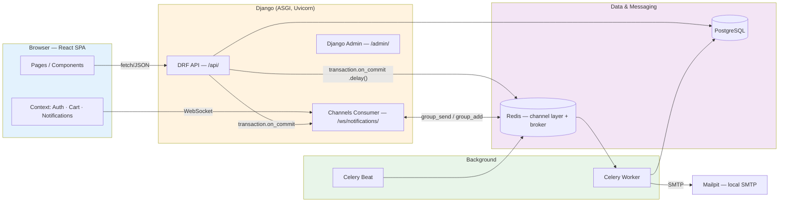
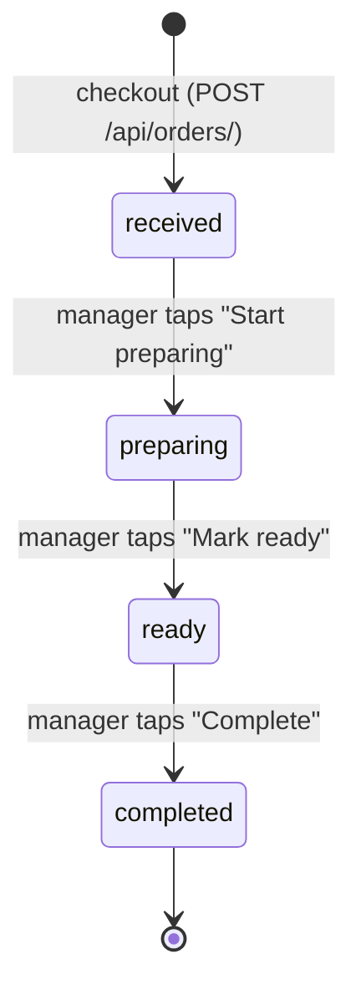
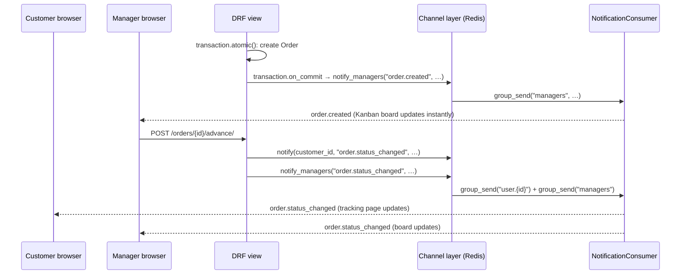

# QLess Cafe

> Part of the [k8s-as-lego](../README.md) Kubernetes learning repo. This document
> covers the QLess Cafe application itself; see the root README for the
> step-by-step Kubernetes guide built around it.

[](https://github.com/cookiecutter/cookiecutter-django/)
[](https://www.python.org/)
[](https://docs.astral.sh/uv/)
[](https://www.djangoproject.com/)
[](https://www.django-rest-framework.org/)
[](https://channels.readthedocs.io/)
[](https://docs.celeryq.dev/)
[](https://www.postgresql.org/)
[](https://redis.io/)
[](https://react.dev/)
[](https://vitejs.dev/)
[](https://github.com/astral-sh/ruff)
[](https://pre-commit.com/)
[](https://www.docker.com/)
[](../LICENSE)

**QLess Cafe** is an order-ahead cafe application: customers browse the menu, customise
and pay for their order (payment simulated) from their phone, and track it in real time;
cafe staff run a live Kanban queue, advance orders through prep, and manage the menu —
all without a customer ever having to queue at the counter.

---

## Table of Contents

- [Overview](#overview)
- [Architecture](#architecture)
- [Order Lifecycle](#order-lifecycle)
- [Tech Stack](#tech-stack)
- [Project Structure](#project-structure)
- [Getting Started](#getting-started)
- [API Reference](#api-reference)
- [Real-Time Notifications](#real-time-notifications)
- [Background Jobs (Celery)](#background-jobs-celery)
- [Testing](#testing)
- [Code Quality](#code-quality)
- [Configuration](#configuration)

---

## Overview

### Key Features

- **Order-ahead checkout** — browse the catalogue, customise items via per-product
  modifier groups (milk, size, extra shot, serve temperature), and check out with a
  pickup preference (ASAP / 10 min / 20 min) and an optional note.
- **Live Kanban board for staff** — every order flows through
  `received → preparing → ready → completed`; managers advance it with a single tap,
  and the board updates for every connected manager instantly, with no polling.
- **Real-time order tracking for customers** — customers watch their own order's
  status change live via the same WebSocket channel.
- **Digital receipts** — a professional HTML receipt email is sent in the background
  (Celery) the moment an order is placed, without blocking the checkout response.
- **Server-trusted pricing** — modifier prices and labels are resolved entirely
  server-side at checkout; the client never dictates a price.
- **Manager stats dashboard** — orders today, pending/ready counts, oldest wait time,
  revenue, and average prep time, computed live from the same order data.

### Who uses it

| Role | Access | What they do |
|------|--------|---------------|
| **Customer** | Any authenticated user | Browse menu, customise & order items, track order status, view order history, edit their profile |
| **Manager** | `is_staff=True` user | Everything a customer can do, plus: the Service Board (Kanban), the stats dashboard, and full catalogue CRUD |

There is no separate "manager" model — a manager is simply a `User` with
`is_staff=True`, created via the Django admin or the `seed_demo_data` command.

---

## Architecture

Django serves the JSON API (`/api/`), the WebSocket endpoint (`/ws/`), and the admin
(`/admin/`); every other route is handled client-side by the React SPA (React Router),
which Django serves as a static bundle built by Vite.



**Django apps** (all under `qless_cafe/`):

| App | Responsibility |
|-----|-----------------|
| `identity` | Custom `User` model (email login, no username), session-based auth API |
| `catalog` | Categories, products, and the modifier-group pricing/labelling engine |
| `orders` | Order + `OrderItem` models, checkout, the Kanban board/status workflow, the receipt-email Celery task |
| `notifications` | The WebSocket consumer and the `notify()` / `notify_managers()` publish helpers used by the other apps |

**Why this shape:**

- **Session auth, not JWT** — it's a same-origin SPA; a plain Django session cookie
  is simpler and avoids token-refresh complexity for no real benefit here.
- **Real-time via Channels + Redis, not polling** — order status and the Kanban board
  need to feel instant; a WebSocket group per user (`user.{id}`) plus one shared
  `managers` group covers both audiences with one consumer.
- **Celery for anything that can be slow or fail** — the only current job is the
  receipt email, dispatched from `transaction.on_commit()` so it never fires for a
  transaction that gets rolled back, and never blocks the checkout response.
- **Server-side pricing** — `resolve_modifiers()` is the single place that turns a
  customer's modifier selections into a price and a label; the client only ever
  displays what the server already computed.

---

## Order Lifecycle



Every status change goes through `POST /api/orders/{id}/advance/` (manager-only),
which:

1. Looks up the next status from a fixed `NEXT_STATUS` mapping (there is no
   "skip a step" or "go backwards").
2. Saves the order and, on commit, pushes an `order.status_changed` event to both
   the customer (`notify()`) and every connected manager (`notify_managers()`).

Two derived, read-only properties drive the UI without any extra queries:

- `age_seconds` / `age_display` / `age_level` — how long an order has been waiting
  (`ok` under 4 minutes, `warn` under 8, `late` after that), used for the Kanban
  card's aging colour and the customer-facing live timer.
- `status_steps` — the four statuses annotated as `done` / `current` / `pending`,
  used to render the progress stepper on the tracking page.

Orders have two identifiers: `id` (a UUIDv7, the real primary key, never shown to
humans) and `order_number` (a `PositiveIntegerField` whose default reads a real
PostgreSQL sequence in production, so concurrent checkouts can never collide — with
a `max()+1` fallback used only for bare local/SQLite runs), displayed as
`display_id` (e.g. `PO-0042`) — that's the number staff read out loud and customers
see.

---

## Tech Stack

### Backend

| Component | Version | Purpose |
|-----------|---------|---------|
| Python | 3.14 | |
| Django | 6.0.8 | Web framework, ORM, admin |
| Django REST Framework | 3.18.0 | JSON API |
| Django Channels | 4.3.2 (+ `channels-redis` 4.3.0) | WebSocket consumer, Redis channel layer |
| Celery | 5.6.3 | Background task queue (+ `django-celery-beat` 2.9.0 for scheduling) |
| PostgreSQL | 18 | Primary datastore (SQLite fallback for bare local runs, see [Getting Started](#getting-started)) |
| Redis | 7.2 | Channels layer + Celery broker/result backend |
| psycopg | 3.3.4 | PostgreSQL driver (C extension) |
| Pillow | 12.3.0 | Product image handling |
| Uvicorn | 0.52.3 | ASGI server (dev + prod) |
| Gunicorn + uvicorn-worker | 26.0.0 / 0.4.0 | Production process manager |

All dependencies are pinned to exact versions (no `>=` ranges) and managed with
[uv](https://docs.astral.sh/uv/); see `pyproject.toml` and `uv.lock`.

### Frontend

| Component | Version | Purpose |
|-----------|---------|---------|
| React | 19.2.8 | UI |
| React Router | 7.18.2 | Client-side routing |
| Vite | 6.4.3 | Dev server + production bundling |
| ESLint | 9.39.5 (flat config) | Linting (react, react-hooks, jsx-a11y) |
| Prettier | 3.9.6 | Formatting |

Django never runs a Node process — the frontend is built once to static files
(`qless_cafe/static/spa/`) that Django serves directly; `npm run dev` is only for
live-reloading local iteration against the same backend.

### Quality tooling

| Tool | Purpose |
|------|---------|
| ruff | Python lint + format |
| mypy + django-stubs + djangorestframework-stubs | Static typing |
| djlint | Django template lint + format |
| pytest + pytest-django + factory-boy | Backend tests |
| celery[pytest] | Realistic Celery worker tests (in-memory broker, no eager mode) |
| pre-commit | Runs all of the above (plus pyproject-fmt, django-upgrade) on every commit |

---

## Project Structure

```text
k8s-as-lego/
├── config/                   # Django project (settings, ASGI, Celery app, root URLs)
│   ├── settings/
│   │   ├── base.py           # Shared settings
│   │   ├── local.py          # Local dev overrides
│   │   ├── production.py     # Production overrides
│   │   └── test.py           # Test settings (locmem email, etc.)
│   ├── asgi.py                # ASGI entrypoint (HTTP + WebSocket routing)
│   ├── celery_app.py          # Celery application instance
│   ├── urls.py                # Root URL conf (admin, /api/, static/media)
│   └── api_urls.py             # Mounts each app's api_urls under /api/
├── qless_cafe/                # Application code
│   ├── identity/               # Custom User model + auth API
│   ├── catalog/                # Categories, products, modifier pricing engine
│   ├── orders/                 # Orders, checkout, Kanban board, receipt-email task
│   ├── notifications/          # WebSocket consumer + notify()/notify_managers()
│   ├── templates/emails/       # Transactional email templates
│   └── conftest.py             # Shared pytest fixtures (incl. Celery test worker)
├── frontend/                   # React SPA (Vite)
│   └── src/
│       ├── pages/               # Route-level screens (+ pages/manager/ for staff-only)
│       ├── components/          # Reusable UI (Nav, TabBar, ItemSheet, LiveDuration, …)
│       ├── context/              # AuthContext, CartContext, NotificationContext
│       └── api/                  # Fetch client (CSRF handling, JSON, error wrapping)
├── compose/                    # Docker build contexts (dev image; prod image also used by k8s builds)
├── docker-compose.yml          # django, postgres, redis, celeryworker, celerybeat, mailpit
├── pyproject.toml               # Python deps + tool config (ruff, mypy, pytest, djlint)
└── manage.py
```

---

## Getting Started

Docker Compose is the primary, fully-featured workflow (Postgres, Redis, Celery,
Mailpit all included). A bare local run (no containers, SQLite instead of Postgres)
is also supported for quick iteration — see [Bare local run](#bare-local-run-no-docker)
below.

### Prerequisites

- Docker & Docker Compose
- Node.js 20+ and npm (only needed if you're changing `frontend/src/`)

### 1. Environment files

Local dev already ships with working `.envs/.local/.django` and
`.envs/.local/.postgres` files — no setup required to get started. For a
production/GKE deployment, config lives in `k8s/overlays/prod/secrets.env`
instead (see [k8s/README.md](../k8s/README.md)); see [Configuration](#configuration)
for the variables that matter.

### 2. Start the stack

```bash
docker compose -f docker-compose.yml up -d
```

| Service | URL | Purpose |
|---------|-----|---------|
| Django | <http://localhost:8000> | App server (API, admin, and the built SPA) |
| Mailpit | <http://localhost:8025> | Catches every outgoing email locally |
| PostgreSQL | `localhost:5432` | Primary database |
| Redis | internal | Channels layer + Celery broker |
| celeryworker | — | Executes background tasks (e.g. receipt emails) |
| celerybeat | — | Scheduled/periodic tasks |

### 3. Migrate and seed demo data

```bash
docker compose -f docker-compose.yml run --rm django python manage.py migrate
docker compose -f docker-compose.yml run --rm django python manage.py seed_demo_data
```

`seed_demo_data` is idempotent (safe to re-run) and creates a demo catalogue plus
two accounts:

| Role | Email | Password |
|------|-------|----------|
| Manager | `manager@qless.cafe` | `Manager-Pass-123!` |
| Customer | `customer@qless.cafe` | `Customer-Pass-123!` |

Visit <http://localhost:8000/> as the customer, or <http://localhost:8000/manage>
as the manager.

### 4. Frontend (only when editing `frontend/src/`)

The built SPA is not committed — Docker serves whatever is currently in
`qless_cafe/static/spa/`, so rebuild after every change:

```bash
cd frontend
npm install
npm run build      # one-shot build into ../qless_cafe/static/spa/
# or, for live reload against the running Docker backend:
npm run dev         # http://localhost:5173, proxies /api and /ws to :8000
```

### Django admin / superuser

```bash
docker compose -f docker-compose.yml run --rm django python manage.py createsuperuser
```

This is the Django admin superuser, unrelated to the app's own manager role
(`is_staff`), which `seed_demo_data` already sets up for you.

### Bare local run (no Docker)

The backend also runs directly on your machine with zero external services — no
Postgres, Redis, or Mailpit install required:

```bash
uv sync
export DJANGO_SETTINGS_MODULE=config.settings.local
uv run python manage.py migrate
uv run python manage.py seed_demo_data
uv run python manage.py runserver
```

With no `POSTGRES_*` environment variables set, `config/settings/base.py` falls
back to a local `db.sqlite3` file, and `config/settings/local.py` swaps in
zero-dependency equivalents for everything else Docker normally provides:

| Concern | Docker | Bare local |
|---------|--------|------------|
| Database | PostgreSQL | SQLite (`db.sqlite3`) |
| Channels layer | Redis | In-process (`channels.layers.InMemoryChannelLayer`) |
| Celery | Worker + beat containers | `CELERY_TASK_ALWAYS_EAGER` (task runs inline, no broker) |
| Outgoing email | Mailpit | Console backend (printed to stdout) |

This is a dev/demo convenience only — production always runs against real
PostgreSQL and Redis (see `config/settings/production.py`); the concurrency
guarantee on `order_number` (see [Order Lifecycle](#order-lifecycle)) also only
holds with PostgreSQL. The frontend still needs its own `npm install` / `npm run
dev` (step 4 above) regardless of which backend workflow you use.

---

## API Reference

All endpoints are mounted under `/api/`. Auth is a same-origin session cookie —
call `GET /api/auth/csrf/` before every unsafe request (POST/PUT/PATCH/DELETE)
to get the current CSRF token and echo it back as the `X-CSRFToken` header.
Deliberately not cached client-side: Django can rotate the token per response,
so a stale cached value silently stops matching and fails every request after
that.

### Auth (`/api/auth/`) — `identity` app

| Method | Path | Auth | Purpose |
|--------|------|------|---------|
| GET | `/csrf/` | Any | Get a fresh CSRF token (call before every unsafe request) |
| POST | `/signup/` | Any | Create an account |
| POST | `/login/` | Any | Session login (email + password) |
| POST | `/logout/` | Authenticated | Clear the session |
| GET | `/me/` | Any (401 if anonymous) | Current user |
| PATCH | `/me/` | Authenticated | Update `name` / `email` |

### Catalogue — `catalog` app

| Method | Path | Auth | Purpose |
|--------|------|------|---------|
| GET | `/api/categories/` | Any | List categories (with nested products) |
| POST/PUT/PATCH/DELETE | `/api/categories/{id}/` | Manager | CRUD a category |
| GET | `/api/products/` | Any | List products (non-staff only see `is_available=True`) |
| POST/PUT/PATCH/DELETE | `/api/products/{id}/` | Manager | CRUD a product |
| GET | `/api/modifier-groups/` | Any | Modifier option labels + prices (pricing reference for the client) |

### Orders — `orders` app

| Method | Path | Auth | Purpose |
|--------|------|------|---------|
| GET | `/api/orders/` | Authenticated | List orders (customers see only their own; managers see all) |
| POST | `/api/orders/` | Authenticated | Checkout — creates the order, queues the manager notification and the receipt email |
| GET | `/api/orders/{id}/` | Authenticated | Order detail (for tracking) |
| POST | `/api/orders/{id}/advance/` | Manager | Move the order to its next status |
| GET | `/api/orders/board/` | Manager | Kanban board — orders grouped by status column |
| GET | `/api/orders/stats/` | Manager | Dashboard stats (orders today, pending/ready, oldest wait, revenue, avg prep time) |

`POST /api/orders/` body:

```json
{
  "items": [{ "product_id": "…", "quantity": 2, "modifiers": { "milk": "oat", "size": "lg" } }],
  "pickup_preference": "in_10",
  "note": "No sugar please"
}
```

Prices, modifier labels, and product availability are all validated and computed
server-side — the client only sends *selections*, never prices.

---

## Real-Time Notifications

A single `NotificationConsumer` (`qless_cafe/notifications/consumers.py`) backs
`ws://…/ws/notifications/`. On connect, an authenticated user joins their personal
group (`user.{id}`); staff also join a shared `managers` group.



Two publish helpers in `notifications/services.py` are the *only* way any app is
allowed to push an event — nothing calls `group_send` directly:

- `notify(user_id, event, payload)` — to one user.
- `notify_managers(event, payload)` — to every connected manager.

Both are always called from inside `transaction.on_commit()`, so an event can never
fire for a database change that ends up rolled back. The frontend
(`NotificationContext`) reconnects with exponential backoff and falls back to a
30-second poll if the socket stays down, so the app degrades gracefully rather than
going silent.

---

## Background Jobs (Celery)

Today there is one task, `qless_cafe.orders.tasks.send_order_receipt_email`:

1. Checkout queues it with `transaction.on_commit(lambda: send_order_receipt_email.delay(...))`
   — it only ever fires for an order that actually committed, and never blocks the
   HTTP response.
2. The task renders `templates/emails/order_receipt.html` (a professional, inline-styled
   receipt — inline styles because email clients strip `<style>` blocks) and sends it
   via SMTP as both HTML and a plain-text fallback.
3. On send failure it retries up to 3 times with a 60-second delay (`bind=True,
   max_retries=3, default_retry_delay=60`).

Locally, outgoing mail is caught by [Mailpit](http://localhost:8025) instead of a
real inbox; bare local runs use the console backend and print messages to stdout.

---

## Testing

```bash
docker compose -f docker-compose.yml run --rm django pytest
docker compose -f docker-compose.yml run --rm django pytest qless_cafe/orders    # scope to one app
```

Tests are colocated per app (`qless_cafe/<app>/tests/`), use `factory-boy` for test
data, and `pytest-django`'s `mailoutbox` fixture for email assertions.

### Celery tests use a real worker, not eager mode

`send_order_receipt_email` is tested by actually dispatching it through Celery's
`memory://` broker to a live worker thread (`celery.contrib.pytest`'s
`celery_session_worker` fixture, configured in `qless_cafe/conftest.py`) — never by
calling the task function directly and never with `task_always_eager`. That means
the test exercises the real dispatch → serialize → queue → worker → execute path,
not just the task's Python body:

```python
pytestmark = [
    pytest.mark.django_db(transaction=True),
    pytest.mark.usefixtures("celery_session_worker"),
]


def test_sends_receipt_with_order_details(self, mailoutbox):
    ...
    send_order_receipt_email.apply_async(args=(str(order.id),)).get(timeout=10)
    assert len(mailoutbox) == 1
```

`django_db(transaction=True)` is required here: the worker runs on its own DB
connection in a separate thread, so it needs to see *committed* data rather than
the test's normally-rolled-back transaction.

---

## Code Quality

```bash
docker compose -f docker-compose.yml run --rm django ruff check .
docker compose -f docker-compose.yml run --rm django ruff format --check .
docker compose -f docker-compose.yml run --rm django mypy qless_cafe
docker compose -f docker-compose.yml run --rm django djlint qless_cafe/templates --lint
docker compose -f docker-compose.yml run --rm django pre-commit run --all-files
```

```bash
cd frontend
npm run lint            # eslint . — react, react-hooks, jsx-a11y rules
npm run format:check    # prettier --check .
```

`.pre-commit-config.yaml` runs the full backend suite (ruff, django-upgrade,
pyproject-fmt, djlint, whitespace/EOF/JSON/YAML/TOML checks) before every commit.

---

## Configuration

Settings are environment-driven (`django-environ`), split across
`config/settings/{base,local,production,test}.py`.

| Variable | Used for |
|----------|----------|
| `POSTGRES_DB` / `POSTGRES_USER` / `POSTGRES_PASSWORD` / `POSTGRES_HOST` / `POSTGRES_PORT` | PostgreSQL connection — omit all of these (e.g. a bare local run) and Django falls back to SQLite (`db.sqlite3`) |
| `REDIS_URL` | Channels layer + Celery broker/result backend |
| `DJANGO_SECRET_KEY` | Session/CSRF signing |
| `DJANGO_DEBUG` | Debug mode |
| `DJANGO_ALLOWED_HOSTS` | Allowed `Host` headers |
| `DJANGO_ADMIN_URL` | Admin mount path |
| `DJANGO_DEFAULT_FROM_EMAIL` | "From" address for receipt emails |
| `EMAIL_HOST` / `EMAIL_PORT` / `EMAIL_USE_TLS` / `EMAIL_HOST_USER` / `EMAIL_HOST_PASSWORD` | Outgoing SMTP (Mailpit locally, real SMTP in production) |

## License

MIT — see [LICENSE](../LICENSE).
